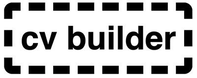

## Table of Contents

-   **[Description](#description)**
-   **[Deployment and Live Demo](#deployment-and-live-demo)**
    -   [Download](#download)
    -   [Clone with Git](#clone-with-git)
    -   [Live Demo](#live-demo)
-   **[UX](#ux)**
    -   [User Stories](#user-stories)
    -   [Wireframes](#wireframes)
    -   [Design](#design)
-   **[Features](#features)**
    -   [CV Sections](#cv-sections)
    -   [Themes](#themes)
    -   [Save Function](#save-function)
    -   [Download as PDF](#download-as-pdf)
    -   [Reset](#reset)
    -   [Responsive Design](#responsive-design)
-   **[Technologies](#technologies)**
-   **[Tools](#tools)**
-   **[Testing](#testing)**
    -   [Manual Testing](#manual-testing)
    -   [User Testing](#user-testing)
    -   [Known Bugs](#known-bugs)
-   **[Upcoming Features](#upcoming-features)**
-   **[Code Notes](#code-notes)**
-   **[Aknowledgments](#aknowledgments)**

---

---

## UX

### User Stories

_Generic User / Job Seeker_

-   I want to build a CV in a simple way
-   I want to be able to save my cv to a pdf
-   I want to be able to organize the information on my CV
-   I want to be able to save a CV in progress and return to it later
-   I want to be able to reset the content of the CV
-   I want to be able to add and delete sections of my CV
-   I want to choose the look and feel of my CV

### Save Function

Any changes made to the CV or its theme can be saved to be updated at a later time.
When saved, the content of the page generates a JSON object which is stored in the browser's local storage. The theme chosen by the user is also saved to local storage.
Upon reload of the page, the saved data and theme are automatically displayed on the page. If no information is found in local storage, a default CV and theme will be displayed.

### Download as PDF

The CV builder uses html2pdf.js to convert the content of the CV into a PDF document, that can be downloaded to the user's device.

### Reset

A reset button at the bottom of the page enables the user to reset the CV's content and theme to their default values. I also clears the local storage. The user has to confirm the reset in a modal window before the content is reset.

### Responsive Design

This application is primarily meant to be used on computer sized screens but it has been optimized to work on mobile devices as well.
It was built responsively with the bootstrap framework, and uses JQuery UI Touch Punch to ensure all functionalities work on touch enabled devices.

---

## Technologies

-   HTML
-   CSS
-   Bootstrap
-   Javascript
-   [JQuery](https://jquery.com/)
-   [JQuery UI](https://jqueryui.com/): for effects on the page and the sortable function
-   JQuery UI Touch Punch: to make JQuery UI's sortable function touch device friendly
-   [html2pdf.js](https://github.com/eKoopmans/html2pdf.js): relies on HTML2canvas and jsPDF to convert the CV to a PDF file
-   [anchorme.js](https://alexcorvi.github.io/anchorme.js/): dynamically finds urls and email addresses on the CV and converts them to anchor tags

---

## Tools

-   VSCode: IDE used to create and edit code
-   Adobe Photoshop: Image editor used for section vignettes and favicon
-   Balsamiq: Used to create wireframes
-   [Font Awesome](https://fontawesome.com/): used for all icons throughout the site
-   [Google Fonts](https://fonts.google.com/): The following fonts were imported from Google fonts for the various themes: Montserrat, Open Sans, Raleway, Roboto, Lato, Jost
-   [Responsive Viewer](https://chrome.google.com/webstore/detail/responsive-viewer/inmopeiepgfljkpkidclfgbgbmfcennb): Chrome extension used to test site at different screen sizes
-   [Pingdom](https://tools.pingdom.com/): used to test site performance
-   [W3C HTML Validator](https://validator.w3.org/): used to validate HTML code
-   [W3C CSS Validator](https://jigsaw.w3.org/css-validator/): used to validate CSS

---

